# HackShack OpenCode Workshop -- Architecture Document

This document describes the architecture of the HackShack OpenCode tutorial environment and how it integrates with the HPE Workshops-on-Demand (WoD) infrastructure.

---

## 1. High-Level Overview

**IDEA**: The HackShack Agentic workshop is a Docker-based, self-contained lab environment that teaches students to use OpenCode (an AI coding assistant) and build AI skills. Each student gets an isolated container with two web services: the **Tutorial Page** (lab docs + embedded OpenCode) and the **OpenCode Web UI** (standalone). The container requires only outbound HTTPS to reach free Zen cloud models -- **no** local GPU, **no** API keys, **no** HPE proprietary dependencies.

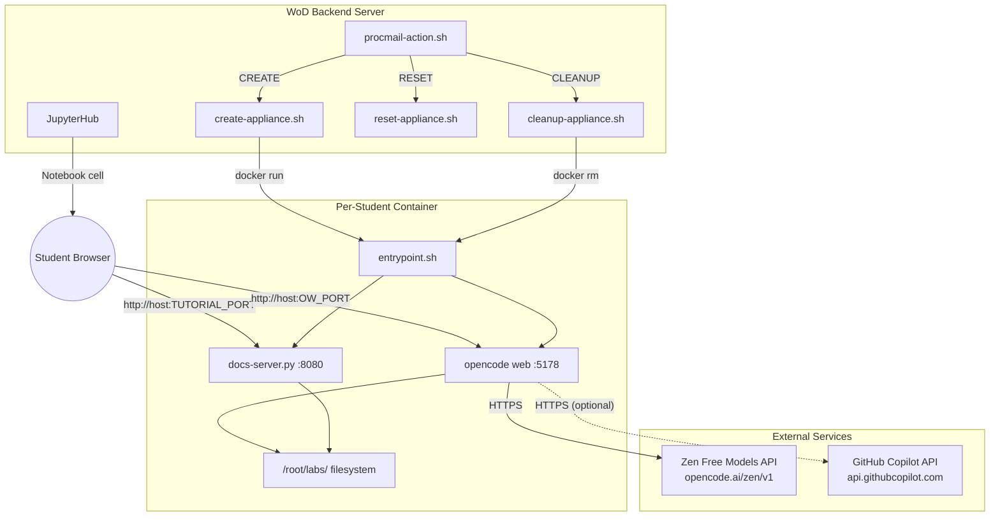

---

## 2. Container Architecture

### 2.1 Docker Image Layers

The image is built from Ubuntu 22.04 and installs all dependencies in a single build. No volumes are mounted -- the container is fully self-contained and disposable.

```mermaid
graph TB
    subgraph "Docker Image (1.6 GB)"
        L1["Ubuntu 22.04 base"]
        L2["System packages<br/>curl, git, jq, python3, vim, nano, build-essential"]
        L3["Zscaler CA cert<br/>config/zscaler-root-ca.crt"]
        L4["Node.js 22 LTS<br/>via NodeSource"]
        L5["opencode-ai (npm -g)"]
        L6["HPE instrospect<br/>/opt/instrospect/ or stub"]
        L7["OpenCode config<br/>/root/.config/opencode/config.json"]
        L8["Lab materials<br/>/root/labs/ (git init)"]
        L9["Validation tests<br/>/root/tests/validate-env.sh"]
        L10["xdg-open stub<br/>/usr/bin/xdg-open (exit 0)"]
    end

    L1 --> L2 --> L3 --> L4 --> L5 --> L6 --> L7 --> L8 --> L9 --> L10

    style L5 fill:#01A982,color:#fff
    style L6 fill:#f9a825,color:#000
```

| Layer | Purpose | Size Impact |
|-------|---------|-------------|
| Ubuntu 22.04 | Base OS | ~77 MB |
| System packages | Build tools, editors, utilities | ~200 MB |
| Node.js 22 | JavaScript runtime for OpenCode | ~100 MB |
| opencode-ai (npm) | AI coding assistant CLI + web UI | ~800 MB |
| instrospect | HPE Skill auditing tool (or stub) | ~5 MB |
| Lab materials | Markdown docs, sample code, configs | ~1 MB |

### 2.2 Build Variants

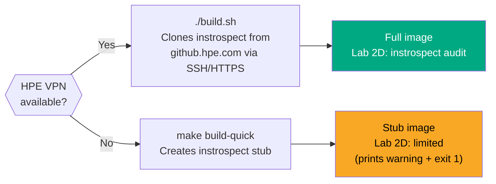

The `build.sh` script tries three clone methods in order: HTTPS with `GHE_TOKEN`, SSH key, then HTTPS with git credential manager. If all fail, the build aborts with instructions. The `make build-quick` target creates a Python stub that prints a warning and exits non-zero, allowing all other labs to work without VPN access.

### 2.3 Instrospect Stub Detection

The Dockerfile uses a grep-based check (not exact first-line match) to distinguish real instrospect from the stub:

```
if [ -f /opt/instrospect/src/skill_review.py ] && \
   ! grep -q "instrospect not available" /opt/instrospect/src/skill_review.py; then
    # Real instrospect -- symlink to /usr/local/bin
else
    # Stub -- print note during build
fi
```

---

## 3. Container Startup Sequence

The entrypoint script orchestrates startup of both services inside the container.

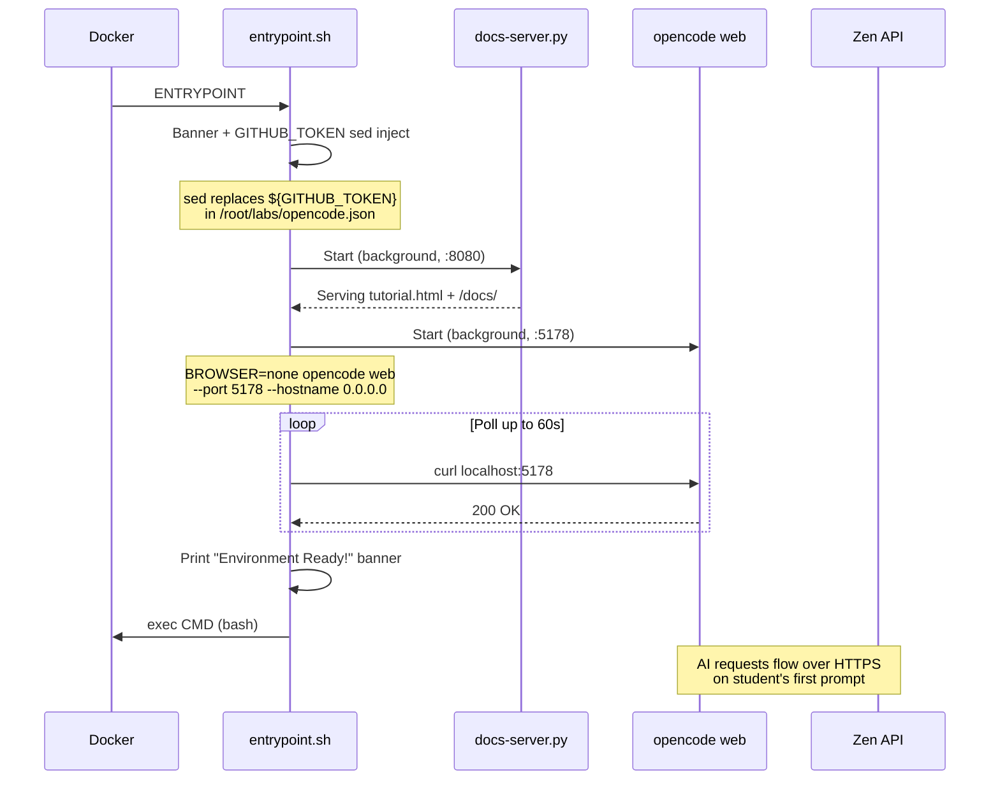

### 3.1 Environment Variables

| Variable | Source | Purpose |
|----------|--------|---------|
| `GITHUB_TOKEN` | docker-compose / WoD | Optional: Copilot API access for faster testing |
| `DOCS_PORT` | Default: 8080 | Tutorial docs server port |
| `OPENCODE_PORT` | Default: 5178 | OpenCode web UI port |
| `SSL_CERT_FILE` | Dockerfile | TLS cert path for Bun/Node |
| `NODE_EXTRA_CA_CERTS` | Dockerfile | Additional CA certs (Zscaler) |
| `STUDENT_NUM` | WoD create script | Student number for port mapping |
| `STUDENT_PWD` | WoD create script | Student password (passed but unused currently) |

### 3.2 Token Injection

OpenCode does not resolve environment variables in its JSON config. The entrypoint uses `sed` to substitute `${GITHUB_TOKEN}` in `/root/labs/opencode.json` at runtime:

```bash
sed -i "s|\${GITHUB_TOKEN}|${GITHUB_TOKEN}|g" /root/labs/opencode.json
```

If no token is provided, the placeholder remains and only built-in Zen free models are available.

---

## 4. Network Topology

### 4.1 Local Development

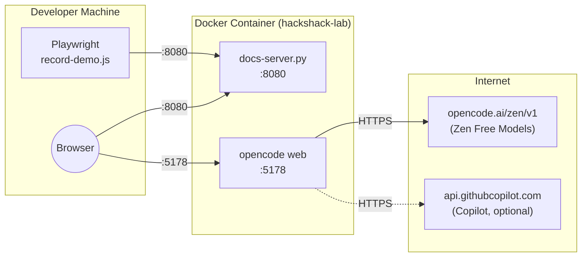

Ports **8080** and **5178** are mapped 1:1 from host to container.

### 4.2 WoD Production (Multi-Student)

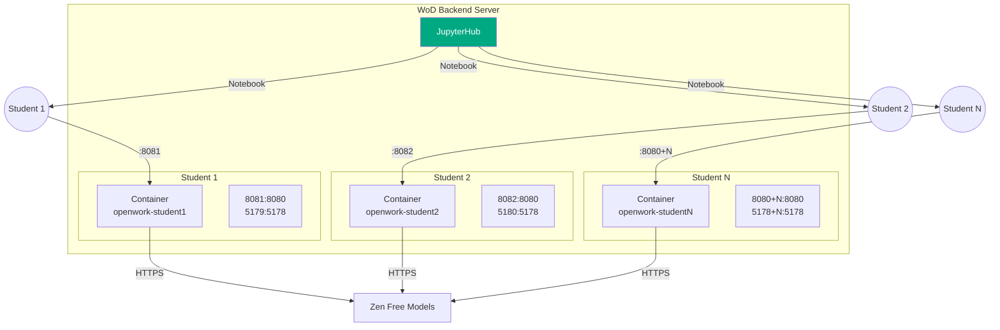

Each student gets unique ports: `TUTORIAL_PORT = 8080 + STUDENT_NUM` and `OW_PORT = 5178 + STUDENT_NUM`. Containers are named `openwork-student${N}` for lifecycle management.

---

## 5. WoD Integration -- __Work-in-Progress__

### 5.1 Integration Architecture

The WoD platform uses JupyterHub as its student-facing entry point. Each workshop provides a thin Jupyter notebook that bootstraps the student into the real lab environment. For this workshop, the notebook is a launcher -- it calculates the student's unique URLs and directs them to the OpenCode tutorial page.

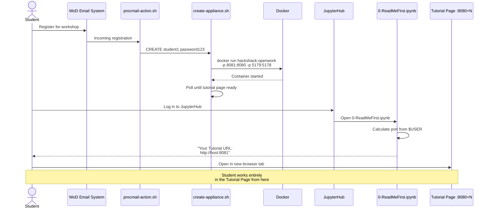

### 5.2 WoD Configuration Files

| File | Purpose |
|------|---------|
| `WKSHP-OpenWork/wod.conf` | Workshop metadata: name, description, duration (105 min), category (AI), backend flag |
| `WKSHP-OpenWork/0-ReadMeFirst.ipynb` | Launcher notebook: calculates student-specific URLs, displays link, health check cell |
| `wod-scripts/create-appliance.sh` | Called on student registration: starts per-student container with unique port mapping |
| `wod-scripts/cleanup-appliance.sh` | Called on session expiry: `docker rm -f` the student's container |
| `wod-scripts/reset-appliance.sh` | Called on reset request: removes container, then re-runs create |

### 5.3 WoD Template Variables

The notebook uses WoD template variables that are substituted at deploy time:

| Variable | Substituted With |
|----------|-----------------|
| `{{ BRANDINGLOGO }}` | HPE HackShack logo HTML |
| `{{ YOURWKSHPBE }}` | Backend server hostname |
| `{{ YOURWORKSHOPDESC }}` | Workshop description from wod.conf |

### 5.4 Appliance Lifecycle

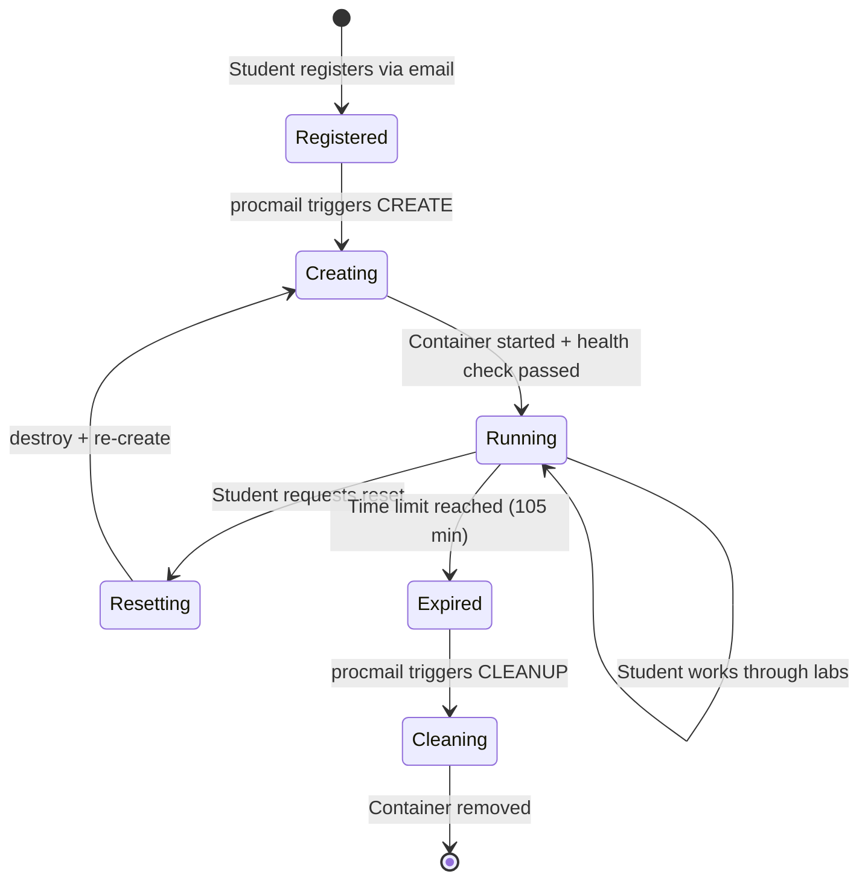

---

## 6. Tutorial Page Architecture

The tutorial page is the primary student interface. It splits the browser into two halves: OpenCode on the left, formatted lab documentation on the right.

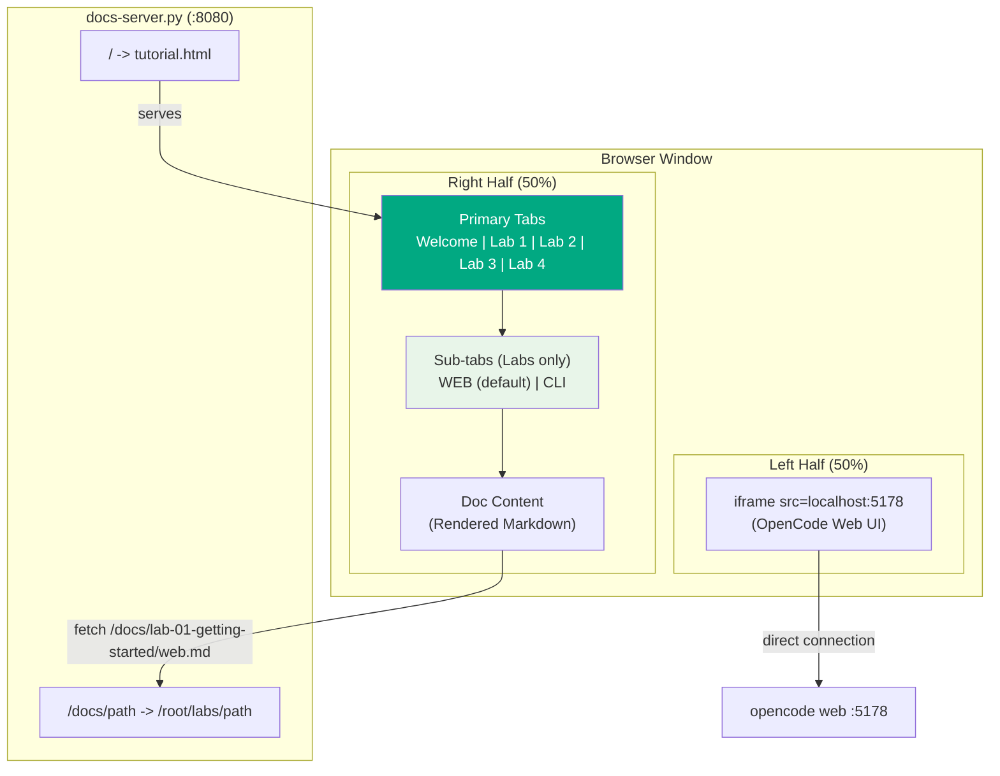

### 6.1 Tab Structure

| Primary Tab | Sub-tabs | Markdown Source |
|-------------|----------|----------------|
| Welcome | (none) | `labs/README.md` |
| Lab 1 | Web / CLI | `lab-01-getting-started/web.md` or `cli.md` |
| Lab 2 | Web / CLI | `lab-02-skills/web.md` or `cli.md` |
| Lab 3 | Web / CLI | `lab-03-agent-workflow/web.md` or `cli.md` |
| Lab 4 | Web / CLI | `lab-04-ingesting-skills/web.md` or `cli.md` |

The "Web" sub-tab is selected by default. Each sub-tab loads a different markdown file -- the Web variant contains instructions referencing the OpenCode web UI (click buttons, use the composer), while the CLI variant has equivalent terminal commands.

### 6.2 Content Rendering Pipeline

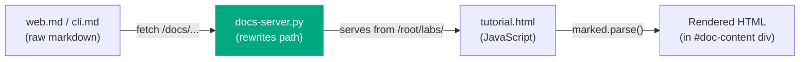

The docs-server.py is a minimal Python HTTP server (22 lines) that:
- Serves `tutorial.html` at `/` and `/index.html`
- Rewrites `/docs/path` to `/path` (relative to `/root/labs/`)
- Lets the browser fetch lab markdown files via the `/docs/` prefix

Markdown is rendered client-side using the `marked` library loaded from CDN.

---

## 7. OpenCode Configuration

### 7.1 Two Config Files

The project has two OpenCode config files serving different purposes:

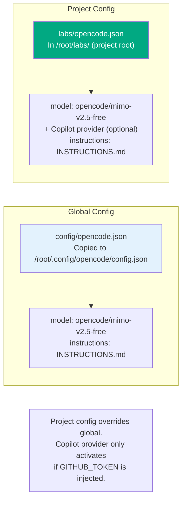

| Config | Path in Container | Contents |
|--------|-------------------|----------|
| Global | `/root/.config/opencode/config.json` | Minimal: model + instructions only |
| Project | `/root/labs/opencode.json` | Model + instructions + optional Copilot provider |

### 7.2 Model Hierarchy

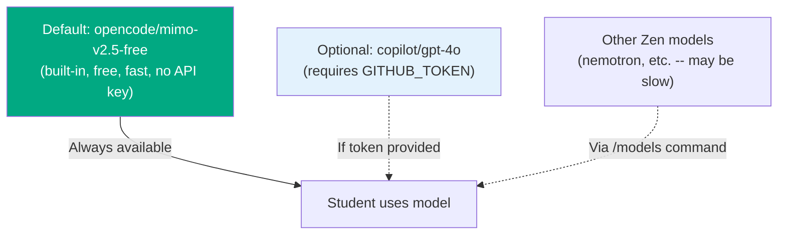

### 7.3 Skill Discovery

OpenCode scans for skills at startup. Skills must have YAML frontmatter with `name` and `description` fields to be discovered:

```markdown
---
name: my-skill
description: What it does and when to trigger it.
---
```

Skills live in `.opencode/skills/<name>/SKILL.md` relative to the project root. Skills created after `opencode web` starts require a new session or restart to be discovered.

---

## 8. Lab Content Architecture

### 8.1 Filesystem Layout

```
/root/labs/                          # Project root (git repo)
  opencode.json                      # Project-level OpenCode config
  INSTRUCTIONS.md                    # System prompt (lab tutor persona)
  README.md                          # Welcome page content
  tutorial.html                      # Tutorial wrapper page
  docs-server.py                     # HTTP server for tutorial + docs
  lab-01-getting-started/
    web.md                           # Lab 1 -- Web UI instructions
    cli.md                           # Lab 1 -- CLI instructions
  lab-02-skills/
    web.md                           # Lab 2 -- Web UI instructions (Parts A-D)
    cli.md                           # Lab 2 -- CLI instructions
    docs/                            # Reference docs for Lab 2 Part C
      server-troubleshooting-guide.md
  lab-03-agent-workflow/
    web.md                           # Lab 3 -- Web UI instructions
    cli.md                           # Lab 3 -- CLI instructions
    sample-project/                  # Intentionally buggy Python files
      app.py
      utils.py
      config.py
  lab-04-ingesting-skills/
    web.md                           # Lab 4 -- Web UI instructions
    cli.md                           # Lab 4 -- CLI instructions
```

### 8.2 Lab Progression

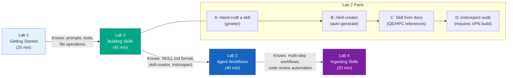

---

## 9. Demo Recording Pipeline

The project includes a Playwright-based recording script that captures a full walkthrough video of all labs.

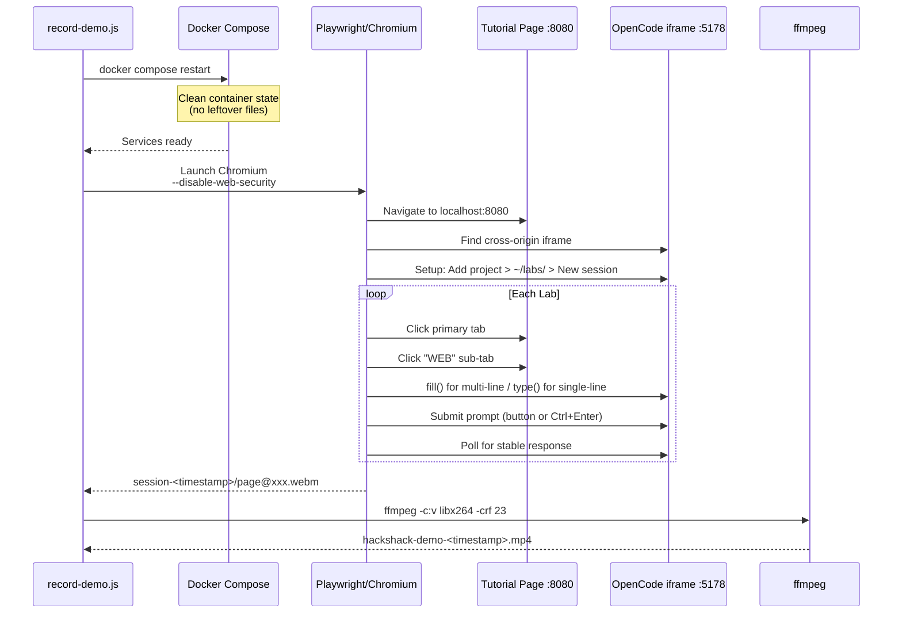

### 9.1 Key Recording Details

| Concern | Solution |
|---------|----------|
| Cross-origin iframe | `--disable-web-security` + `--disable-features=IsolateOrigins,site-per-process` |
| Multi-line prompts | `fill()` pastes entire prompt (avoids Enter sending per-line) |
| Single-line prompts | `keyboard.type()` for visual character-by-character effect |
| Clean state | Container restarted before recording |
| Response detection | Poll iframe content until stable (no new text for 3s) |
| Video format | Playwright records WebM; ffmpeg converts to MP4 |

### 9.2 Makefile Targets

```
make video          # Full recording (all labs, ~6 min)
make video-lab1     # Lab 1 only
make video-lab2     # Lab 2 only
make video-lab3     # Lab 3 only
make video-headless # All labs, no visible browser window
```

---

## 10. Resource Requirements

### 10.1 Per-Container

| Resource | Limit | Notes |
|----------|-------|-------|
| Memory | 2 GB | Set via docker-compose / create-appliance.sh |
| CPU | 2 cores | Set via docker-compose / create-appliance.sh |
| Disk | ~1.6 GB (image) + ephemeral writes | No persistent volumes |
| Network | Outbound HTTPS only | opencode.ai (Zen), optionally api.githubcopilot.com |

### 10.2 Server Capacity Planning

With 20+ concurrent students, each needing a 2 GB / 2 CPU container:

| Students | Memory | CPUs | Ports |
|----------|--------|------|-------|
| 10 | 20 GB | 20 | 8081-8090, 5179-5188 |
| 20 | 40 GB | 40 | 8081-8100, 5179-5198 |
| 40 | 80 GB | 80 | 8081-8120, 5179-5218 |

### 10.3 Known Constraints

| Constraint | Impact | Mitigation |
|------------|--------|------------|
| Zen free models have no SLA | Responses may be slow (30s+) or unavailable | mimo-v2.5-free is reliable; warn students about slow alternatives |
| Free models skip system instructions | Tutor persona (INSTRUCTIONS.md) may not activate | Labs still work; greeting just won't match tutor template |
| No persistent storage | Container restart = clean slate | By design for lab isolation; could add volumes if needed |
| Port arithmetic (`8080+N`) | Limited to ~900 students per server | Sufficient for WoD scale |

---

## 11. Security Considerations

| Area | Status |
|------|--------|
| No API keys required | Zen free models work without credentials |
| GITHUB_TOKEN (optional) | Injected via env var, sed-substituted at runtime, never committed |
| No volume mounts | Container filesystem is isolated; no host data exposure |
| No privileged mode | Containers run as root inside container only |
| Zscaler CA | Baked into image for corporate TLS inspection; harmless in non-corporate environments |
| instrospect policy | Runs from /opt/instrospect (outside project dir); OpenCode shows policy warning students must accept |
| Lab content | Public-only references (no proprietary HPE content); warning against pasting proprietary data into public models |

---

## 12. File Inventory

```
HackShack/
  ARCHITECTURE.md          # This document
  TLDR.md                  # Quick-start guide
  README.md                # Project README
  Dockerfile               # Container image definition
  docker-compose.yml       # Local development compose file
  entrypoint.sh            # Container startup script
  build.sh                 # Full build script (clones instrospect)
  Makefile                 # Build, run, video, clean targets
  record-demo.js           # Playwright demo recording script
  config/
    opencode.json          # Global OpenCode config (minimal)
    zscaler-root-ca.crt    # Corporate TLS inspection cert
    INSTRUCTIONS.md        # Lab tutor system prompt
  labs/                    # All lab content (copied into container)
    opencode.json          # Project-level config (+ optional Copilot)
    tutorial.html          # Tutorial wrapper page
    docs-server.py         # HTTP server for tutorial + docs
    README.md              # Welcome page
    INSTRUCTIONS.md        # Lab tutor prompt
    lab-01-getting-started/
    lab-02-skills/
    lab-03-agent-workflow/
    lab-04-ingesting-skills/
  tests/
    validate-env.sh        # 26-check environment validation
  wod-scripts/
    create-appliance.sh    # WoD: start per-student container
    cleanup-appliance.sh   # WoD: remove container on expiry
    reset-appliance.sh     # WoD: destroy + re-create
  WKSHP-OpenWork/
    0-ReadMeFirst.ipynb    # JupyterHub launcher notebook
    wod.conf               # WoD workshop metadata
  recordings/              # Demo video output (gitignored)
  instrospect/             # Cloned at build time (gitignored)
```

---

## 13. Integration Checklist for WoD Team

To deploy this workshop on the WoD infrastructure:

- [ ] **Docker image**: Build with `./build.sh` (VPN) or `make build-quick` (no VPN). Push to the WoD container registry.
- [ ] **wod.conf**: Verify `WKSHP-OpenWork/wod.conf` metadata (name, duration, category) matches WoD catalog requirements.
- [ ] **Appliance scripts**: Place `wod-scripts/create-appliance.sh`, `cleanup-appliance.sh`, and `reset-appliance.sh` where `procmail-action.sh` expects them. Ensure Docker socket access from the WoD backend.
- [ ] **Notebook**: Place `WKSHP-OpenWork/0-ReadMeFirst.ipynb` in the standard WoD notebook directory. Template variables (`{{ BRANDINGLOGO }}`, `{{ YOURWKSHPBE }}`, `{{ YOURWORKSHOPDESC }}`) will be substituted by the WoD framework.
- [ ] **Network**: Ensure outbound HTTPS to `opencode.ai` is allowed from the backend server. No inbound ports beyond the per-student mapping are needed.
- [ ] **Capacity**: Plan for 2 GB RAM + 2 CPUs per concurrent student. A 64 GB / 32 CPU server supports ~16 concurrent students comfortably.
- [ ] **GITHUB_TOKEN** (optional): If Copilot access is desired for faster responses, set `GITHUB_TOKEN` in the environment or pass it through create-appliance.sh.
- [ ] **instrospect** (optional): If Lab 2D full functionality is needed, ensure `github.hpe.com` is reachable during the Docker build.
- [ ] **Firewall**: Only outbound HTTPS (443) to `opencode.ai` is required. No inbound internet access needed.
